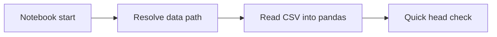
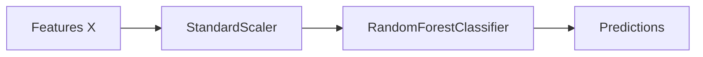
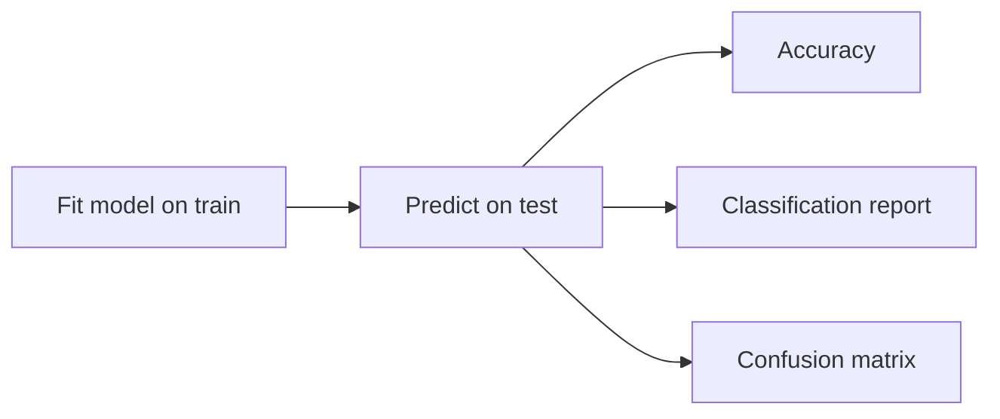

## Notebook Walkthrough: Credit Card Rewards Classifier

Audience: Beginner data scientist. This guide explains every code block and why it exists.

### 0. Orientation and Goals
- Predict `Reward_Tier` (Basic/Gold/Platinum) from numeric spending features.
- Keep code reproducible, readable, and safe against common pitfalls (data leakage, overfitting).

### 1) Imports and Data Loading
Code (simplified):
```python
import pandas as pd
import numpy as np
from pathlib import Path

try:
    NOTEBOOK_DIR = Path(__file__).resolve().parent
except NameError:
    NOTEBOOK_DIR = Path.cwd()
DATA_PATH = (NOTEBOOK_DIR.parent / 'data' / 'credit_card_rewards_5000.csv').resolve()

df = pd.read_csv(DATA_PATH)
df.head(10)
```
Why:
- `pandas` loads tabular data; `numpy` is base numeric library.
- We compute a stable path to the CSV whether running in Jupyter or as a script.
- `head(10)` is a quick sanity check on columns and sample values.

What to look for:
- Column names match expectations; no obvious parsing issues.

Data loading flow:


### 2) Quick EDA (sanity and shape)
Code highlights:
```python
print('Shape:', df.shape)
print('\nColumns:', list(df.columns))
print('\nDtypes:')
print(df.dtypes)
print('\nMissing values per column:')
print(df.isna().sum())
print('\nReward_Tier distribution:')
print(df['Reward_Tier'].value_counts(normalize=True).rename('proportion'))
```
Why:
- Ensure there are no missing values or data-type mismatches.
- Check label balance (class imbalance affects evaluation and modeling choices).

Tips:
- If missing values exist, decide whether to impute, drop, or engineer.

### 3) Visual EDA
Code highlights:
```python
import matplotlib.pyplot as plt
import seaborn as sns

numeric_cols = ['Annual_Income','Monthly_Average_Spend','Transactions_Per_Month',
                'Online_Offline_Spend_Ratio','Travel_Spend_Ratio','Dining_Spend_Ratio']

fig, axes = plt.subplots(2, 3, figsize=(14, 8))
for i, col in enumerate(numeric_cols):
    sns.histplot(df[col], kde=True, ax=axes.ravel()[i])
```
Why:
- Validate distributions and potential outliers.
- Heatmap of correlations helps understand redundancy among features.

Good practices:
- Keep visual ranges consistent; annotate axes and titles.

### 4) Train/Test Split and Pipeline
Code highlights:
```python
from sklearn.model_selection import train_test_split
from sklearn.preprocessing import StandardScaler
from sklearn.pipeline import Pipeline
from sklearn.ensemble import RandomForestClassifier

feature_cols = ['Annual_Income','Monthly_Average_Spend','Transactions_Per_Month',
                'Online_Offline_Spend_Ratio','Travel_Spend_Ratio','Dining_Spend_Ratio']
X = df[feature_cols]
y = df['Reward_Tier']

X_train, X_test, y_train, y_test = train_test_split(
    X, y, test_size=0.2, random_state=42, stratify=y
)

model = Pipeline(steps=[
    ('scaler', StandardScaler()),
    ('rf', RandomForestClassifier(n_estimators=300, random_state=42))
])
```
Why:
- `train_test_split` with `stratify=y` preserves class proportions.
- `Pipeline` ties preprocessing and model so we avoid leakage and keep reproducibility.
- `StandardScaler` centers/scales features, keeping units comparable.
- RandomForest is robust, handles nonlinear interactions, and is a strong baseline.

Gotchas:
- Always fit the scaler on `X_train` only; the pipeline ensures this.

Pipeline overview:


### 5) Training and Evaluation
Code highlights:
```python
from sklearn.metrics import accuracy_score, classification_report, confusion_matrix

model.fit(X_train, y_train)
y_pred = model.predict(X_test)
acc = accuracy_score(y_test, y_pred)
print(classification_report(y_test, y_pred))
cm = confusion_matrix(y_test, y_pred, labels=sorted(y.unique()))
```
Why:
- `classification_report` shows precision/recall/F1 per class.
- The confusion matrix reveals specific misclassifications (e.g., Platinum mislabelled).

Interpreting results:
- High accuracy with poor minority-class recall can be misleading. Inspect per-class metrics.

Evaluation process:


### 6) Feature Importance
Code highlights:
```python
rf = model.named_steps['rf']
importances = rf.feature_importances_
```
Why:
- Helps explain which numeric features the RandomForest uses most.

Caveat:
- Importance is model-specific and not causal; use with care.

### 7) Cross-Validation (optional)
Code highlights:
```python
from sklearn.model_selection import cross_val_score, StratifiedKFold
cv = StratifiedKFold(n_splits=5, shuffle=True, random_state=42)
cv_scores = cross_val_score(model, X, y, cv=cv, scoring='accuracy', n_jobs=-1)
```
Why:
- Provides a stability estimate across different train/validation splits.

### 8) Extended Text Pipeline (optional)
Code highlights:
```python
from sklearn.compose import ColumnTransformer
from sklearn.feature_extraction.text import TfidfVectorizer
from sklearn.linear_model import LogisticRegression
```
Why:
- Demonstrates combining numeric features with text via TF‑IDF and a linear classifier.

Trade-offs:
- Text can help if summaries correlate with tiers; it also adds complexity.

### 9) Practical Production Notes
- Save the fitted `Pipeline` using `joblib.dump(model, 'credit_card_rewards_model.pkl')`.
- Validate inputs at inference (ranges, types) before calling `predict`.
- Monitor performance and retrain periodically.

### 10) Common Pitfalls Checklist
- Forgetting `stratify=y` on splits when classes are imbalanced.
- Fitting preprocessing on the full dataset (leakage) instead of train only.
- Reporting only accuracy instead of per-class metrics.
- Not fixing the random seed (`random_state=42`) when you want reproducibility.


