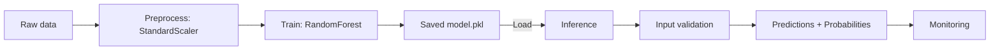
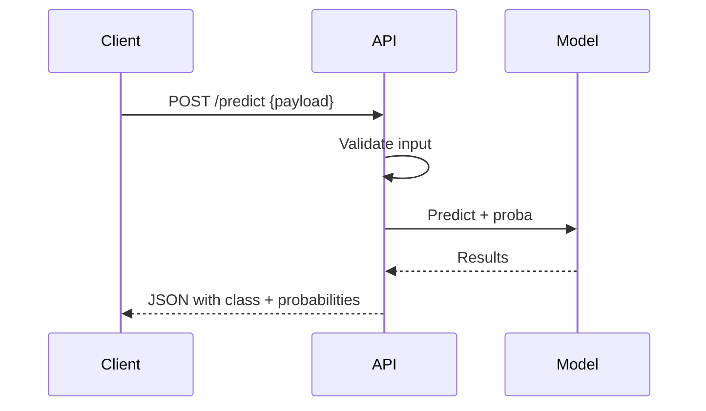

## Pipeline, Inference, and Best Practices

This document explains how to go from raw data to predictions safely and reproducibly.

### 1) End-to-End Pipeline Structure
We build a `sklearn.pipeline.Pipeline` that contains:
- Preprocessing: `StandardScaler` for numeric features
- Estimator: `RandomForestClassifier`

Why a pipeline?
Architecture overview:

- Prevents data leakage by fitting transforms only on the training portion.
- Keeps training and inference steps consistent.
- Simplifies persistence (save/load one object).

### 2) Training Flow
1. Split data: `train_test_split(X, y, stratify=y, random_state=42)`
2. Define pipeline:
   ```python
   model = Pipeline([
       ('scaler', StandardScaler()),
       ('rf', RandomForestClassifier(n_estimators=300, random_state=42))
   ])
   ```
3. Fit: `model.fit(X_train, y_train)`
4. Evaluate: accuracy, classification report, confusion matrix

### 3) Hyperparameters Worth Tuning
- `rf__n_estimators`: number of trees (100–500)
- `rf__max_depth`: depth of trees (10, 20, None)
- `rf__min_samples_split` / `rf__min_samples_leaf`: regularization

Grid example:
```python
from sklearn.model_selection import GridSearchCV
param_grid = {
    'rf__n_estimators': [100, 200, 300],
    'rf__max_depth': [10, 20, None],
    'rf__min_samples_split': [2, 5, 10]
}
grid = GridSearchCV(model, param_grid, cv=5, scoring='accuracy')
grid.fit(X_train, y_train)
```

### 4) Handling Class Imbalance
Symptoms: minority class (e.g., Platinum) has low recall.

Options:
- Use `class_weight='balanced'` or custom weights
- Resample (SMOTE, undersampling) on training data only
- Calibrate thresholds or optimize for recall/F1 instead of accuracy

### 5) Persistence
```python
import joblib
joblib.dump(model, 'credit_card_rewards_model.pkl')
model = joblib.load('credit_card_rewards_model.pkl')
```
Store artifacts with metadata (training date, data version, feature list).

### 6) Inference (Batch and Real-Time)
Input validation:
```python
REQUIRED = ['Annual_Income','Monthly_Average_Spend','Transactions_Per_Month',
            'Online_Offline_Spend_Ratio','Travel_Spend_Ratio','Dining_Spend_Ratio']

def validate_row(row):
    for k in REQUIRED:
        if k not in row:
            raise ValueError(f'Missing: {k}')
    if row['Annual_Income'] < 0:
        raise ValueError('Annual_Income must be positive')
    for r in ['Online_Offline_Spend_Ratio','Travel_Spend_Ratio','Dining_Spend_Ratio']:
        if not (0 <= row[r] <= 1):
            raise ValueError(f'{r} must be in [0,1]')
```

Batch prediction:
```python
df = pd.DataFrame(rows)
preds = model.predict(df)
probs = model.predict_proba(df)
```

Real-time API: wrap validation + prediction in a REST endpoint (Flask/FastAPI).

Deployment flow (real-time):


### 7) Monitoring and Retraining
- Track distribution drift in features and predictions
- Monitor per-class precision/recall over time
- Keep a retraining cadence and data versioning

### 8) Reproducibility Checklist
- Pin dependencies (`requirements.txt`)
- Fix random seeds (`random_state` everywhere)
- Save pipeline and exact feature order
- Log data snapshot and commit hash for experiments


